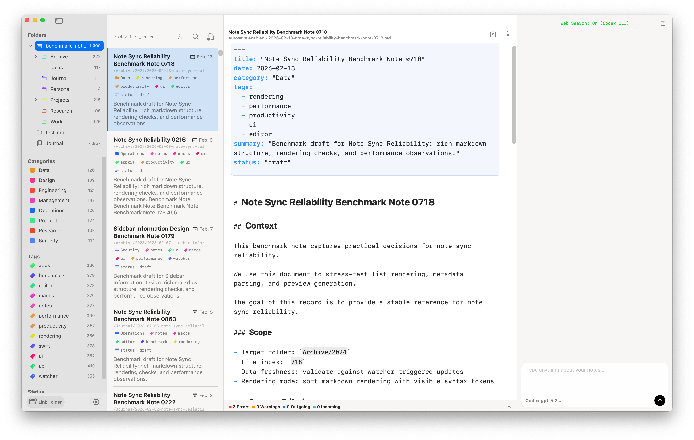
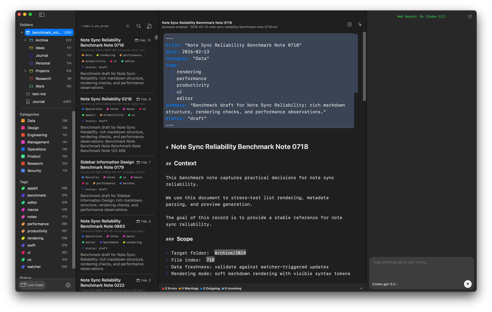

# Mai Releases

Mai is a native macOS knowledge workspace for local Markdown files, now with an integrated AI Agent for real note operations.

## Download

- Latest releases: https://github.com/herrkaefer/mai-releases/releases
- Current recommended build: **v1.4.0**  
  https://github.com/herrkaefer/mai-releases/releases/tag/v1.4.0

## Why Mai

- **Local-first, no lock-in**: your notes stay as plain Markdown files in your own folders.
- **Native speed**: pure Swift/AppKit desktop app, optimized for large note collections.
- **Realtime sync**: external file edits are reflected immediately.
- **Practical structure**: categories, tags, filters, directories, backlinks, and full-text search.

## New: AI Agent Workflow

Mai now includes a production-ready AI Agent layer for Markdown knowledge work:

- **Tool-driven actions**: the agent reads/writes notes through explicit tools instead of hallucinated edits.
- **Safety by default**: mutating tools require in-app user confirmation.
- **Skill system**: reusable skills are loaded from both app-level and vault-level directories.
- **On-demand skill reading**: built-in `read_skill` tool allows the model to fetch full skill content when needed.
- **Manual skill activation**: run prompts with `/skill:name` for deterministic workflow control.
- **Optional web search**: when available, the agent can bring in fresh external references with source links.

## What Mai Is Not

- **Not a Markdown editor replacement**: keep using your preferred writing tool.
- **Not a proprietary data container**: no private document format, no migration trap.
- **Not a forced workflow**: Finder and external tooling remain first-class.

## Road Ahead

Mai keeps improving around high-signal local knowledge workflows: stronger agent skills, better automation, and tighter reliability for real-world note operations.
