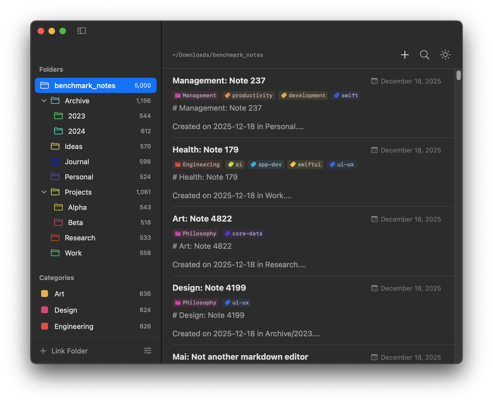

## What Mai Is Not

- **Not a Markdown editor**: Mai doesn’t replace your editor. You keep writing in your preferred professional Markdown tools.
- **Not a data silo**: Mai never owns your files. Your notes remain plain Markdown in local folders.
- **Not a controller**: No forced file management. Mai works alongside your existing Finder workflow.

## What Mai Is

- **A knowledge manager**: Built specifically to organize and navigate local Markdown documentation.
- **A high-performance browser**: A lightweight viewer offering a structured, bird’s-eye view across multiple folders.
- **A workflow bridge**: Connects raw files on disk to a modern, searchable knowledge base—without moving or converting them.

## Key Highlights

- **Pure Swift native macOS app**: Super lightweight and blazing fast
- **Real-time sync**: Instantly reflects any file changes
- **Zero lock-in**: Local storage is the single source of truth—portable and future-proof
- **Fast full-text search**

## What Mai will be

Say tuned.

